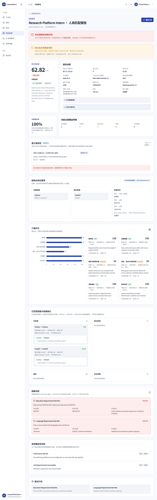
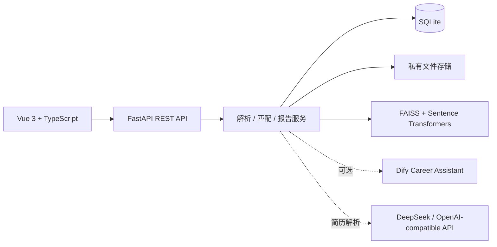

# CareerPilot AI

**基于证据的 AI 求职匹配与职业决策平台**

CareerPilot AI 面向求职者提供一条可追溯的简历分析与岗位决策链路：简历解析结果必须绑定原文证据，岗位要求来自结构化输入，匹配结果由确定性规则与受控的语义相关性共同生成，并以可解释报告呈现。

[](https://www.python.org/)
[](https://vuejs.org/)
[](https://docs.docker.com/compose/)



## 项目简介

传统的 LLM 岗位匹配容易出现技能幻觉、评分不可解释，以及语义相似度掩盖学历/语言/任职资格冲突等问题。CareerPilot 将“事实、规则、语义信号”分层处理：

- 简历技能只有在具备用户确认的原文证据时才参与匹配。
- 只有人工确认的不可变简历版本可以进入正式匹配。
- 六维确定性评分是主信号，70/30 混合模式中的语义检索只提供辅助信号。
- 阻断风险独立于技能缺口展示，避免高相似度掩盖硬性不合格。
- 报告保存输入快照、证据链、评分版本和风险解释，便于复核。

## 核心流程


## 核心功能

- PDF / DOCX 简历上传、DeepSeek 结构化解析、证据绑定与人工确认。
- 手动结构化岗位输入与 CSV / 确定性导入。
- 六维确定性评分、70/30 规则与语义辅助信号。
- 技能缺口、证据覆盖率、阻断风险和可解释匹配报告。
- 轻量级求职进度看板。

生产匹配链路使用结构化岗位输入，不依赖 AI Job Parsing。LLM 岗位解析作为独立 Provider 能力验证过，但不是核心产品路径，以保持结果可复现并降低幻觉风险。

### 可选集成

Career Assistant 支持 Demo / 可选的 Dify 集成；真实 Dify 连接不属于 Core Portfolio 验证范围。

### 隐藏实验模块

Resume Optimization 与 Chat Interview 仍保留在代码和测试中，但默认导航隐藏，不作为已完成的核心 AI 功能宣传。

## 系统架构



## 技术栈

| 层次 | 技术 |
| --- | --- |
| 前端 | Vue 3、TypeScript、Vite、Pinia、Vue Router、Tailwind CSS、Axios |
| 后端 | Python 3.12、FastAPI、Pydantic v2、SQLAlchemy 2、Alembic |
| AI 与检索 | DeepSeek（OpenAI-compatible）、Sentence Transformers、FAISS、可选 Dify |
| 匹配 | 六维确定性规则、70/30 混合评分、LangGraph 工作流 |
| 数据 | SQLite、私有本地文件存储 |
| 工程质量 | Pytest、Ruff、mypy、Vitest、ESLint、Playwright、Docker Compose |

## 快速开始：Docker Demo

Demo 使用 Fake / Mock Provider，不需要 DeepSeek 或 Dify API Key。

```powershell
git clone https://github.com/YUKANN518/CareerPilot-AI.git
cd CareerPilot-AI
docker compose up --build
```

访问：

- 前端：http://localhost:5173
- 后端健康检查：http://localhost:8000/api/health
- API 文档：http://localhost:8000/docs

Demo 账号为本地合成账号：

```text
邮箱：admin@careerpilot.local
密码：Admin123456!
```

完整演示路径：登录 → 简历 → 岗位 → 岗位匹配 → 匹配报告。停止服务：`docker compose down`。

## 项目验证

验证数据为小规模合成样本或人工标注，不代表招聘结果预测。

- `eval-v1`：52 个冻结回归案例，必需技能、缺失技能、阻断风险、证据有效性均达到 100%，未发现不支持的技能声明。
- `holdout-v1`：必需技能 F1 100.00%，缺失技能 F1 66.66%，阻断风险召回率 40.00%，推荐一致率 65.00%，证据有效性 100.00%。
- `parsing-v1`：简历技能 F1 97.30%，证据绑定 100%，岗位要求 F1 100%，必需/加分分类准确率 100%。
- Real DeepSeek：6/6 简历结构化有效、10/10 岗位结构化有效、简历证据绑定 100%、测试样本未发现不支持的技能声明。

## 工程质量

已完成 CPU-only Docker 构建、健康检查和 Demo/Fake 浏览器冒烟流程。后端产品测试 222 个、评测测试 8 个、前端单元测试 91 个、E2E 测试 16 个均通过；Ruff、mypy、TypeScript、ESLint、Alembic 与 Playwright 验证通过。

## 诚实的局限

- 评测数据规模有限且主要为合成样本。
- 独立 holdout 的阻断风险召回率为 40%，推荐一致率为 65%，不应外推为生产级准确率。
- 语义相关性只能帮助排序，不能证明候选人具备技能。
- SQLite 适合本作品集和 Demo 范围，不面向大规模并发生产流量。
- 真实 Dify 连接是可选集成，未纳入 Core Portfolio 验证。

## 文档

- [系统架构](docs/ARCHITECTURE.md)
- [Demo 演示脚本](docs/DEMO_SCRIPT.md)
- [匹配方法](docs/MATCHING_METHODOLOGY.md)
- [简历项目表述](docs/RESUME_BULLETS.md)

## License

CareerPilot AI 使用 [MIT License](LICENSE)。
