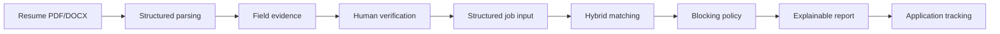

# CareerPilot AI

**Evidence-Grounded AI Job Matching & Career Decision Platform**

CareerPilot AI is an explainable job-matching platform that combines evidence-backed resume
parsing, deterministic business rules, and semantic relevance. It is designed to reduce
hallucinated skill claims and make every recommendation traceable to a resume, a job requirement,
or an explicit uncertainty.

[](https://www.python.org/)
[](https://vuejs.org/)
[](https://docs.docker.com/compose/)


## Why CareerPilot?

Typical LLM matchers have three hard-to-debug failure modes: they may invent candidate skills,
return similarity scores without a reason, and let a strong semantic match hide a hard eligibility
conflict. CareerPilot separates these concerns:

- **Evidence-backed skills** — a skill is usable for matching only when it is attached to source
  text and a location in the resume.
- **Human-verified versions** — only confirmed, immutable resume versions enter the matcher.
- **Deterministic + semantic matching** — six business dimensions remain the primary signal;
  local semantic retrieval is a supporting signal, never proof of a skill.
- **Blocking-risk policy** — education, language, eligibility, and other hard conflicts are shown
  separately from skill gaps.
- **Explainable reports** — scores, evidence, missing requirements, input snapshots, and scoring
  versions are persisted for review.
- **Reproducible validation** — regression, independent holdout, parsing, real-provider, and
  Docker Demo checks are kept as separate claims.

## Core workflow



## Core portfolio features

- PDF/DOCX resume upload, parsing, evidence attachment, and human verification.
- Manual structured job input, CSV import, and requirement representation.
- Six-dimension deterministic scoring with a 70/30 deterministic/semantic hybrid mode.
- Skill gaps, evidence coverage, blocking risks, and explainable match reports.
- Lightweight application tracking with status history and notes.

Job requirements used by the production matcher come from structured job input. Real LLM job
parsing was independently validated as a provider capability, but is intentionally not required
by the production matching path. This keeps matching reproducible and reduces hallucination risk.

### Optional integrations

- **Career Assistant / Dify** — an optional Dify-backed integration with a Fake mode for local
  demos. Real Dify deployment is not part of the Core Portfolio claim.

### Hidden experimental modules

Resume Optimization and Chat Interview remain implemented and tested, but are hidden from the
default portfolio navigation. Learning plans, cover letters, extra agents, and new matching
dimensions are out of scope.

## Quick start: Docker Demo

The recommended first run is an isolated Demo/Fake stack. It does not need a DeepSeek, Dify, or
other external API key.

```powershell
git clone <your-repository-url>
cd CareerPilot
docker compose up --build
```

Open:

- Frontend: <http://localhost:5173>
- Backend health: <http://localhost:8000/api/health>
- API docs: <http://localhost:8000/docs>

Demo credentials are local-only synthetic credentials:

```text
Email:    admin@careerpilot.local
Password: Admin123456!
```

The stack uses `AI_PROVIDER=mock`, `EMBEDDING_PROVIDER=fake`, and an isolated runtime under
`data/runtime/docker-demo/`. Stop it with `docker compose down`.

## Local development

Requirements: Python 3.12+, Node.js 20+, npm, and SQLite.

```powershell
cd backend
py -3.12 -m pip install uv
uv sync --locked --extra dev
uv run alembic upgrade head
uv run uvicorn app.main:app --reload --host 127.0.0.1 --port 8000
```

In another terminal:

```powershell
cd frontend
npm ci
npm run dev
```

Copy `.env.example` to `.env` before local configuration. Never commit `.env`.

## Technology stack

| Area | Technology |
| --- | --- |
| Frontend | Vue 3, TypeScript, Vite, Pinia, Vue Router, Tailwind CSS, Axios |
| Backend | Python 3.12, FastAPI, Pydantic v2, SQLAlchemy 2, Alembic |
| AI providers | OpenAI-compatible API / DeepSeek for resume parsing; Dify for optional Career Assistant |
| Matching | Deterministic six-dimension rules, optional local semantic supporting signal, LangGraph workflow |
| Retrieval | Sentence Transformers, FAISS; deterministic fake embeddings in Demo mode |
| Data | SQLite and private local file storage |
| Quality | Pytest, evaluation fixtures, Ruff, mypy, Vitest, ESLint, Playwright |
| Delivery | Docker Compose, uv.lock, npm lockfile, GitHub Actions CI |

## Evaluation and honest limitations

The metrics below are small synthetic or manually annotated measurements. They are not hiring
outcome predictions, population estimates, or a claim of general model accuracy.

### Regression validation (`eval-v1`)

52 frozen resume-job cases cover skill gaps, blocking requirements, incomplete postings, and
insufficient evidence. The deterministic-v1.1 baseline reports 100% required-skill F1, 100%
missing-skill F1, 100% blocking-risk F1, 100% evidence validity, and 0% unsupported skill claims
on this regression set.

### Independent holdout (`holdout-v1`)

20 independently authored cases expose long-tail generalization limits:

| Metric | Result |
| --- | ---: |
| Required skill F1 | 100.00% |
| Missing skill F1 | 66.66% |
| Blocking risk recall | 40.00% |
| Recommendation agreement | 65.00% |
| Evidence validity | 100.00% |

The holdout failures are retained. They show that aliases, hard eligibility interpretation, and
recommendation calibration still need work before making production-scale claims.

### Parsing validation (`parsing-v1`)

Ten synthetic resumes (five PDF and five DOCX) and ten job descriptions were evaluated:

- Resume skill F1: **97.30%** (precision 100.00%, recall 94.74%).
- Resume evidence attachment: **100.00%**.
- Job requirement F1: **100.00%**.
- Required-vs-preferred accuracy: **100.00%**.

### Real provider validation

The opt-in DeepSeek run made 23 calls: six resumes, ten job descriptions, and seven Career
Assistant/RAG calls. Results were:

- Resume schema-valid outputs: **6/6**.
- Job schema-valid outputs: **10/10**.
- Resume evidence attachment: **100.00%**.
- Unsupported skill claims in tested resumes: **0**.
- Three unsupported questions were refused deterministically; citation correctness and
  groundedness remain marked for manual review rather than overstated.

## Engineering quality

- 222 backend product tests and 8 evaluation tests.
- 91 frontend unit tests and 16 existing E2E tests.
- Ruff, mypy, TypeScript, ESLint, Alembic, and clean-clone checks pass.
- CPU-only Docker build, health checks, and the complete Demo/Fake browser smoke pass.
- Secret-safe Demo mode; no credentials are required for CI or Docker.

## Enable real DeepSeek

The default Demo does not use external providers. To run the opt-in real-provider validation,
configure the names in `.env.example` locally, set `AI_PROVIDER=openai_compatible` and
`RUN_REAL_AI_TESTS=1`, then run:

```powershell
cd backend
.\.venv\Scripts\python.exe -m scripts.validate_real_provider --force
```

Never put a real key in README, Markdown reports, screenshots, Git history, or a committed `.env`.

## Architecture

The frozen architecture is documented in [docs/ARCHITECTURE.md](docs/ARCHITECTURE.md). It shows
only the Vue/FastAPI services, SQLite/private storage, FAISS retrieval, and the optional Dify
boundary—no unimplemented Redis, Kafka, Kubernetes, or cloud vector database.

## Limitations

- Evaluation data is synthetic and limited in size.
- Independent holdout blocking-risk recall is 40%; recommendation agreement is 65%.
- Semantic relevance supports prioritization but cannot prove a candidate capability.
- Resume parsing depends on source document quality and evidence locations.
- Real Dify connectivity is optional and is not part of the public Core Demo.
- SQLite is appropriate for this portfolio/demo scope, not large-scale production traffic.
- Dependency advisories are documented in [DEPENDENCY_SECURITY_REPORT.md](DEPENDENCY_SECURITY_REPORT.md)
  and were not force-upgraded.

## Further portfolio material

- [Demo script](docs/DEMO_SCRIPT.md)
- [Portfolio summary](docs/PORTFOLIO_SUMMARY.md)
- [Resume bullets](docs/RESUME_BULLETS.md)
- [Interview pitch](docs/INTERVIEW_PITCH.md)
- [Technical interview Q&A](docs/TECHNICAL_INTERVIEW_QA.md)
- [Final tech stack](docs/TECH_STACK.md)
- [GitHub metadata](docs/GITHUB_METADATA.md)
- [Project status](docs/PROJECT_STATUS.md)
- [Development notes](docs/development/README.md)
- [Publication security checklist](PUBLICATION_SECURITY_CHECKLIST.md)

## License

CareerPilot AI is released under the [MIT License](LICENSE).
