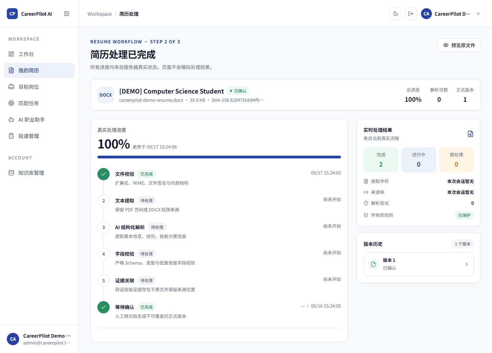
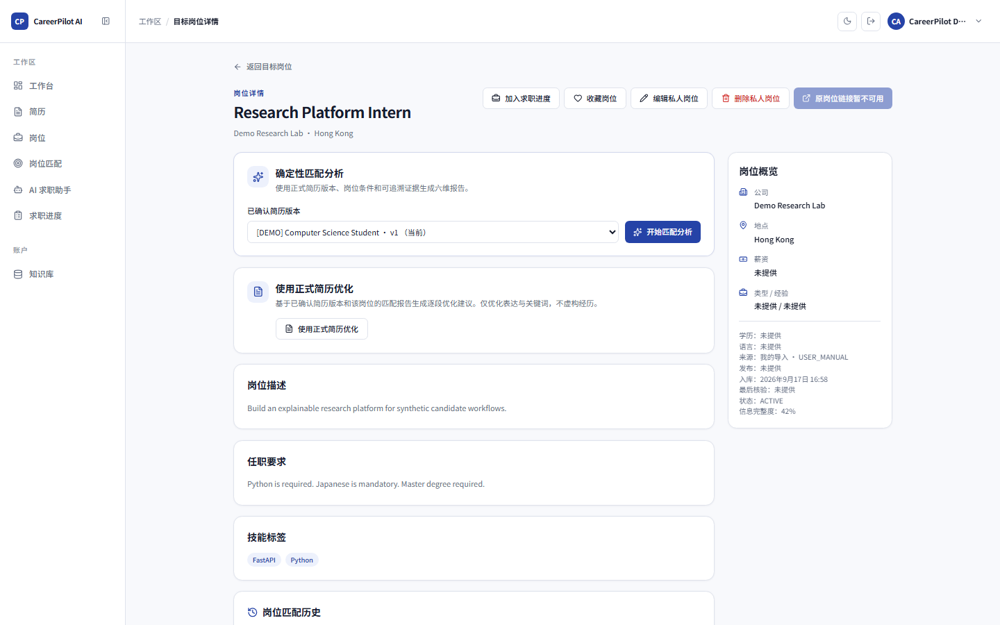
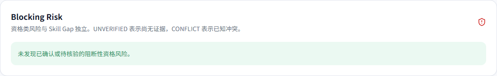
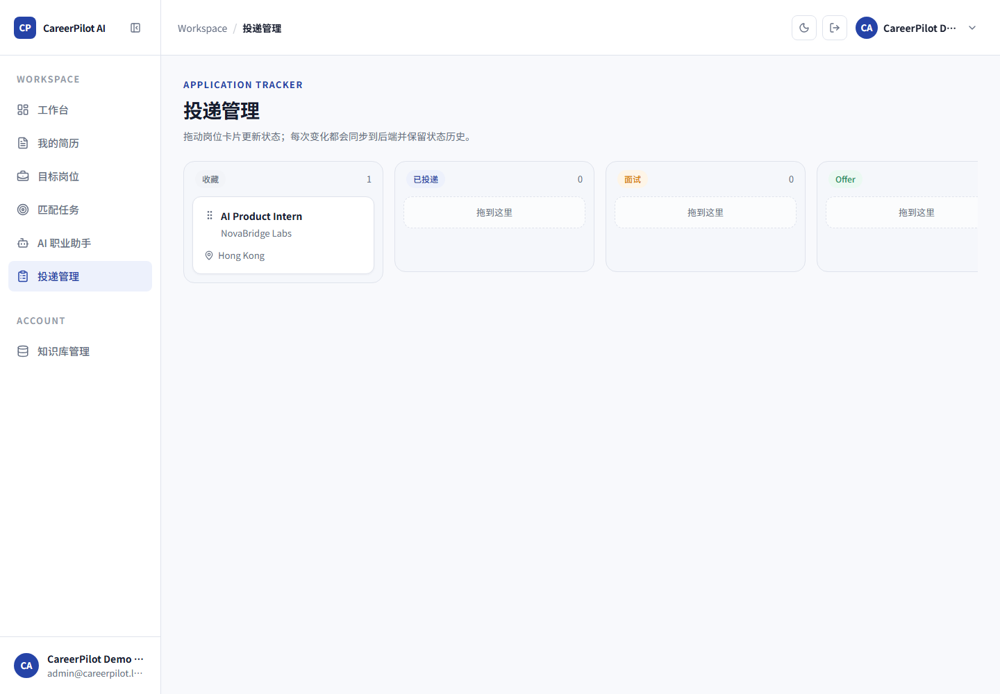
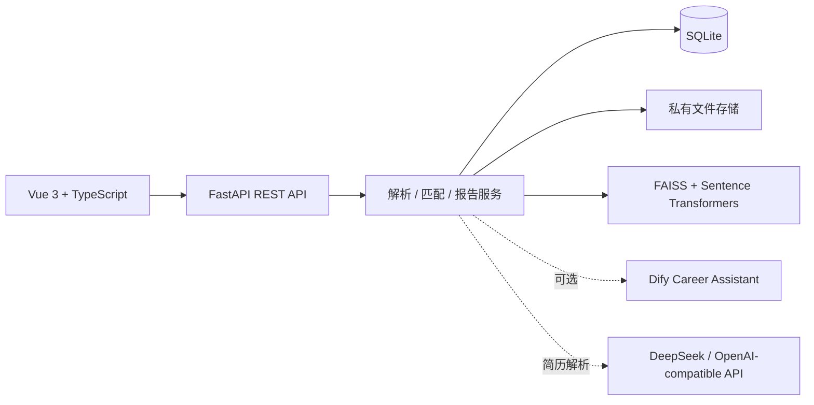

# CareerPilot AI

**AI 驱动的简历与岗位匹配助手，提供证据约束的简历解析、可解释匹配和技能差距分析。**

[](https://www.python.org/)
[](https://vuejs.org/)
[](https://docs.docker.com/compose/)

## Demo Preview

| 简历原文证据与人工确认 | 结构化岗位输入 |
| --- | --- |
|  |  |

| 可解释匹配报告 | 阻断风险 | 求职进度看板 |
| --- | --- | --- |
|  |  |  |

## 核心流程

CareerPilot 将“事实、规则、语义信号”分层处理。简历解析结果必须绑定原文证据并由用户确认；岗位要求来自结构化输入；确定性规则是匹配主信号，本地语义检索只提供辅助信号；最终报告保存输入快照、证据链、评分版本、技能差距与阻断风险，便于复核。


## 关键功能

- PDF / DOCX 简历上传、DeepSeek 结构化解析、证据绑定与人工确认。
- 手动结构化岗位输入与 CSV / 确定性导入。
- 六维确定性评分与 70/30 规则/语义混合评分。
- 技能差距、证据覆盖率、阻断风险与可解释匹配报告。
- 轻量级求职进度看板。

生产匹配链路使用结构化岗位输入，不依赖 AI Job Parsing。LLM 岗位解析作为独立 Provider 能力验证过，但不是核心产品路径，以保持结果可复现并降低幻觉风险。

## 可选与实验性能力

Career Assistant 是可选集成：它通过 FAISS 检索本地知识库与用户个人上下文，并可接入 Dify 生成回答。Demo/Fake 路径和产品接口已有测试覆盖，但真实 Dify 连接尚未完成全量验证，因此不属于 Core Portfolio 功能。

Resume Optimization 与 Chat Interview 保留在代码和测试中，但默认导航隐藏，不作为已完成的核心 AI 功能宣传。

## 系统架构



## 技术栈

| 层次 | 技术 |
| --- | --- |
| 前端 | Vue 3、TypeScript、Vite、Pinia、Vue Router、Tailwind CSS、Axios |
| 后端 | Python 3.12、FastAPI、Pydantic v2、SQLAlchemy 2、Alembic |
| AI 与检索 | DeepSeek（OpenAI-compatible）、Sentence Transformers、FAISS、可选 Dify |
| 匹配 | 六维确定性规则、70/30 混合评分、LangGraph 工作流 |
| 数据 | SQLite、私有本地文件存储 |
| 工程质量 | Pytest、Ruff、mypy、Vitest、ESLint、Playwright、Docker Compose |

## 快速开始：Docker Demo

Demo 使用 Fake / Mock Provider，不需要 DeepSeek 或 Dify API Key。

```powershell
git clone https://github.com/YUKANN518/CareerPilot-AI.git
cd CareerPilot-AI
docker compose up --build
```

访问地址：

- 前端：http://localhost:5173
- 后端健康检查：http://localhost:8000/api/health
- API 文档：http://localhost:8000/docs

Demo 账号为本地合成账号：

```text
邮箱：admin@careerpilot.local
密码：Admin123456!
```

完整演示路径：登录 → 简历 → 岗位 → 岗位匹配 → 匹配报告。停止服务：`docker compose down`。

## 质量验证

项目包含冻结回归集、独立 holdout、PDF/DOCX 解析样本及 opt-in Real Provider 验证，用于检查技能识别、缺失技能、硬性条件判断、证据绑定和推荐结果的一致性。数据主要为合成或人工标注样本，不代表招聘结果预测；已知失败和限制仍保留在结果中。详细方法与结果见 [Evaluation 文档](evaluation/README.md)。

当前验证基线包括 222 个后端产品测试、8 个评测测试、91 个前端单元测试和 16 个浏览器 E2E 测试，并覆盖 Ruff、mypy、TypeScript、ESLint、前端构建、CPU-only Docker 构建及 Demo/Fake 冒烟链路。

## 诚实的局限

- 评测数据规模有限且主要为合成样本，独立 holdout 仍保留已知失败。
- 语义相关性只能帮助排序，不能证明候选人具备技能。
- SQLite 适合本作品集和 Demo 范围，不面向大规模并发生产流量。
- 真实 Dify 连接是可选集成，未纳入 Core Portfolio 验证。

## 文档

- [系统架构](docs/ARCHITECTURE.md)
- [Demo 演示脚本](docs/DEMO_SCRIPT.md)
- [匹配方法](docs/MATCHING_METHODOLOGY.md)
- [简历项目表述](docs/RESUME_BULLETS.md)

## License

CareerPilot AI 使用 [MIT License](LICENSE)。
