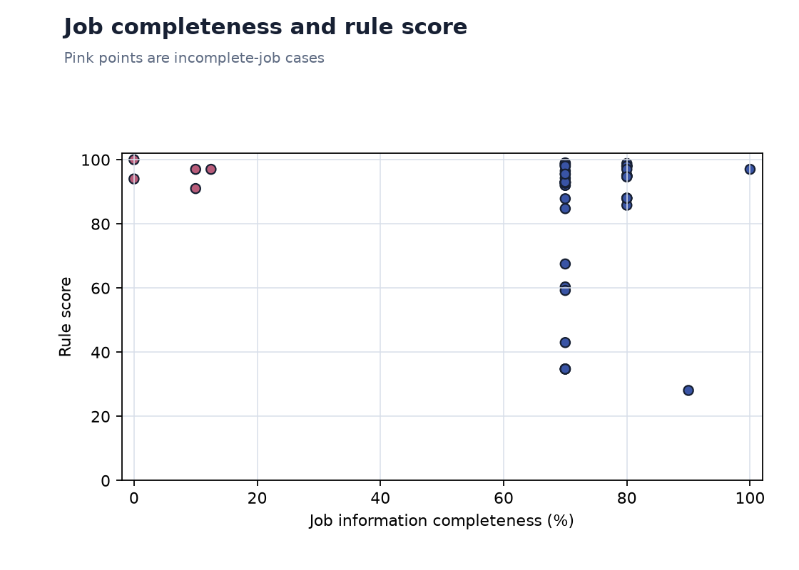
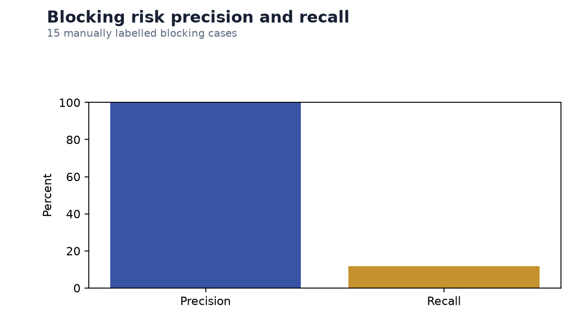
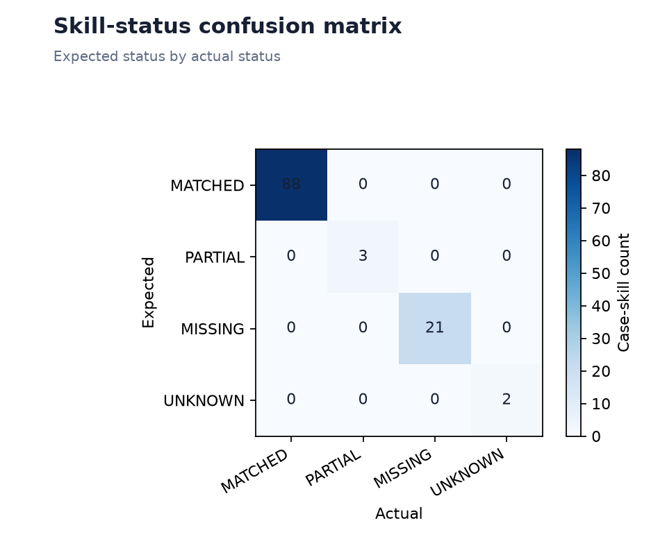
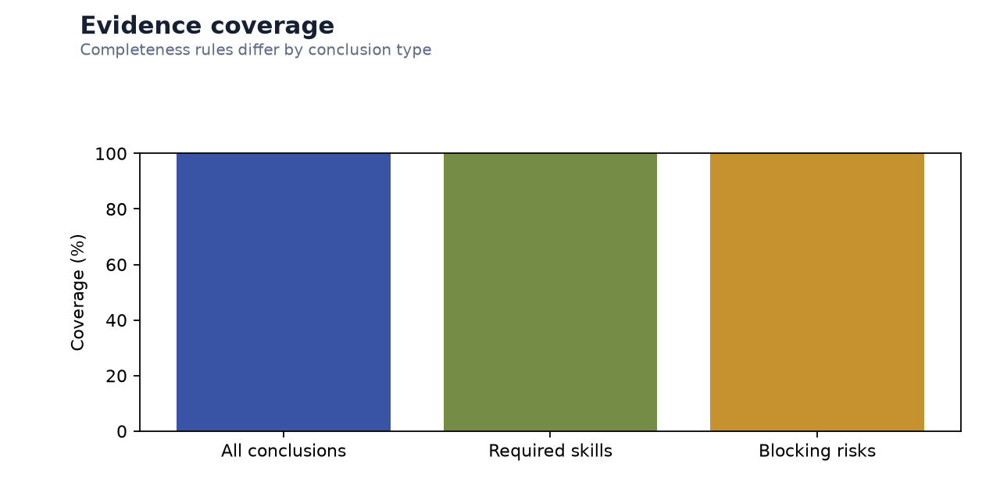
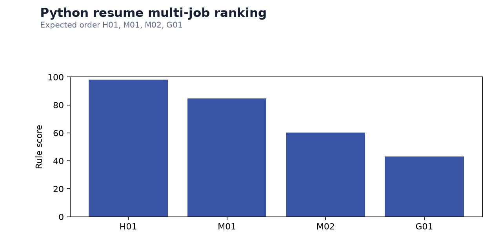
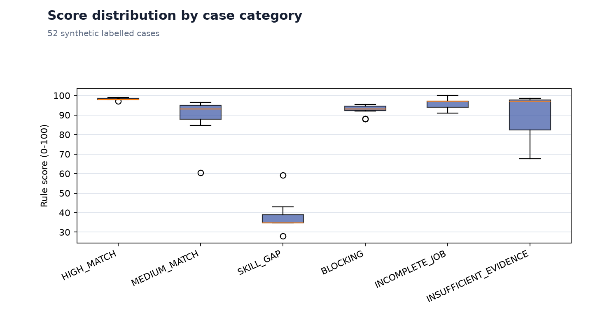
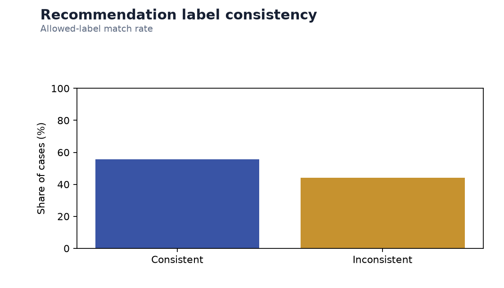
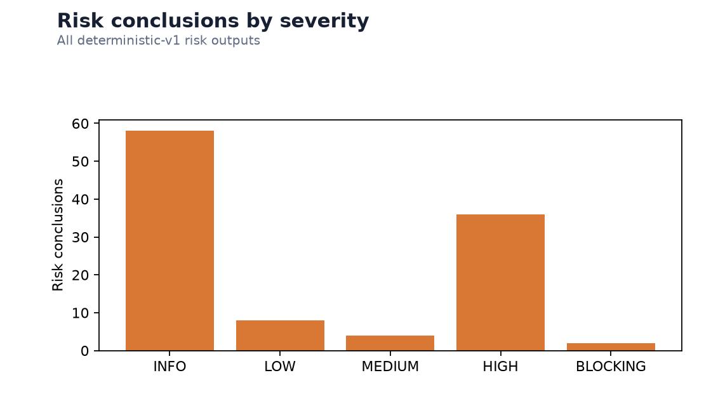
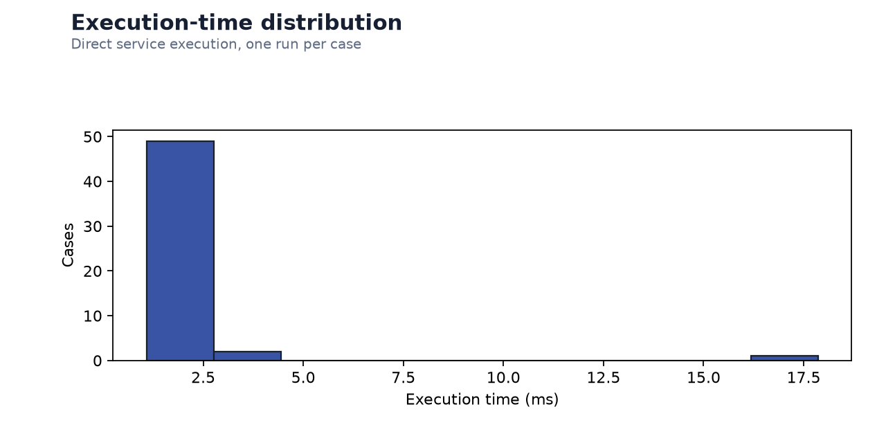

# deterministic-v1 Matching Evaluation

## Technical summary

The released deterministic-v1 engine remains fully repeatable with strong skill-state agreement
and traceable evidence. The expanded policy set exposes its intentionally narrow BLOCKING
definition and sparse-posting overconfidence. The reviewed deterministic-v1.1 comparison is in
`version-comparison.md`; no deterministic-v1 rule or historical report was changed.

- Dataset: 52 anonymous synthetic cases.
- Recommendation consistency: 55.8%.
- Score interval hit rate: 100.0%; interval MAE:
  0.00.
- Blocking precision/recall: 100.0% /
  11.8%.
- Skill macro F1: 100.0%; repeat consistency:
  100.0%.

## Incomplete postings expose a confidence problem

The 5 sparse-posting cases have completeness values from
0.0% to
12.5%, while their rule scores
remain between 91.00 and
100.00. This is descriptive evidence that missing
criteria are treated neutrally and can yield an overconfident recommendation.

The score itself remains untouched for historical reproducibility. deterministic-v1.1 adds
configured completeness and confidence caps without changing rule_score.

## Blocking recall is the release gate

The 15 manually labelled cases cover explicit work authorization, mandatory
certificate, mandatory language, large explicit experience gaps, and non-substitutable degree
minimums. deterministic-v1 marks only work authorization as BLOCKING; the versioned
blocking-policy-v1 comparison addresses the remaining policy categories.

## Skill states and evidence remain strong

Evidence trace coverage is 100.0%; required-skill evidence
coverage is 100.0%. Missing and UNKNOWN skills retain
job-side evidence without fabricated resume evidence.

## Stability and ranking

Repeated outputs are identical at 100.0%. The Python-resume
ranking has exact accuracy 100.0%, pairwise accuracy
100.0%, and Spearman correlation
1.000.

## Score and recommendation distribution

Category score ranges mostly follow the labelled ordering. The remaining overlap is expected:
the released engine scores known criteria and does not treat a sparse posting as inherently
weak.

Recommendation consistency is lower than score-interval agreement because the manual policy
uses stricter Blocking and incomplete-posting expectations than deterministic-v1.

## Risk mix and execution timing

The severity mix confirms that deterministic-v1 emits mandatory language, certificate,
experience, and degree gaps as HIGH rather than BLOCKING. That is a policy mismatch, not a
runtime failure.

Execution time is reported only as a local-process diagnostic. It is excluded from stability
signatures and must not be interpreted as an API service-level objective.

## Scope and methodology

All cases use synthetic resumes and jobs. The runner invokes SkillNormalizationService,
JobRequirementExtractor, and DeterministicMatchEngine directly. Score error is distance to the
nearest labelled interval boundary. Skill metrics use a four-class confusion matrix.
Repeatability excludes execution time but includes score, recommendation, risks, skill states,
evidence ordering, dimensions, and config snapshot.

## Limitations and next steps

- The dataset is deliberately small and synthetic; it does not estimate population performance.
- Synthetic labels do not replace legal or recruiting-domain review.
- Timing is a local-process micro-benchmark, not an API latency or throughput benchmark.
- Keep deterministic-v1 as the production default until version-selection and report
  presentation changes are approved; the v1.1 quantitative gate result is documented
  separately.
