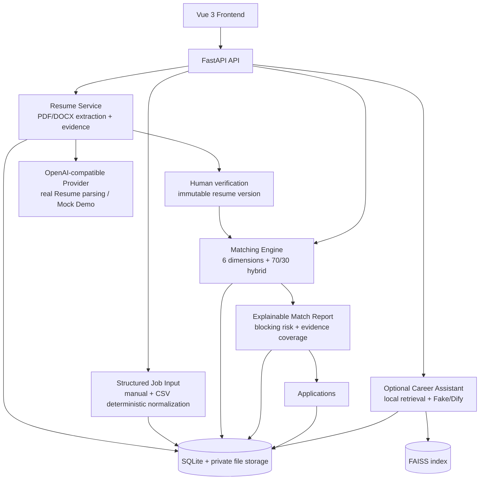

# CareerPilot AI 系统架构

CareerPilot 是一个模块化 FastAPI + Vue 应用。下图对应已冻结的作品集范围；可选集成会明确标注，不暗示不存在的基础设施。

## 核心边界

- 简历解析可使用配置的 OpenAI-compatible Provider；Demo 模式使用 Mock 输出。
- 匹配只消费已确认的简历证据和结构化岗位输入，不依赖 LLM 岗位解析，并遵循冻结的确定性/混合评分策略。
- 求职进度是建立在岗位和报告之上的轻量状态跟踪层。

## 可选与隐藏边界

- Career Assistant 是可选 Dify 集成；本地检索与引用逻辑保留在后端，Fake 模式适用于 Demo 和 CI。
- Resume Optimization 与 Chat Interview 是隐藏实验模块，不属于作品集核心路径。
