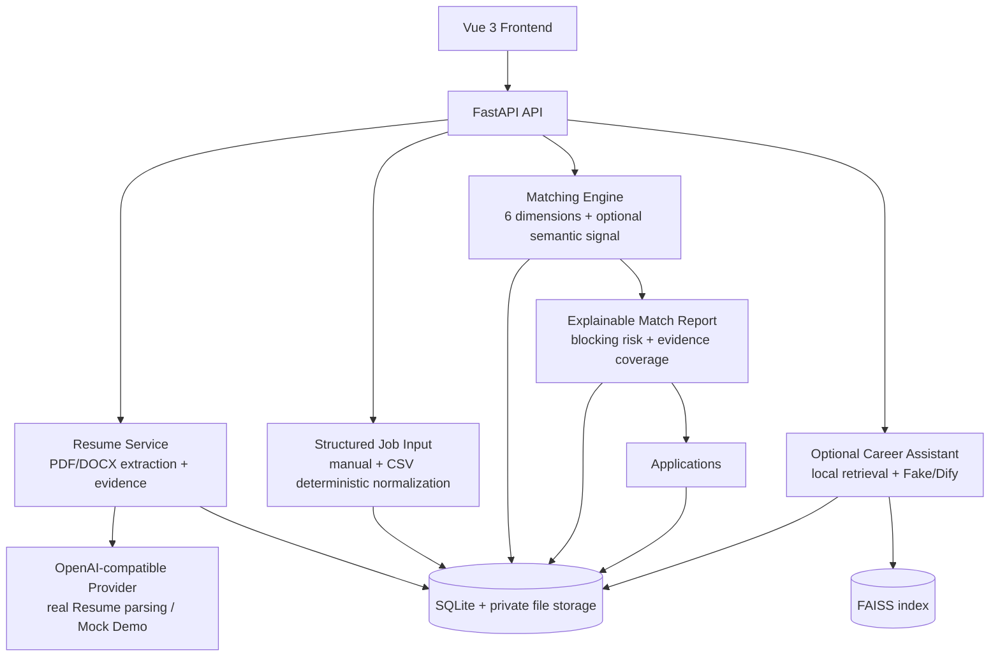

# CareerPilot AI Architecture

CareerPilot is a modular FastAPI + Vue application. The diagram reflects the frozen portfolio
scope; optional integrations are shown explicitly and no unimplemented infrastructure is implied.

## Core boundaries

- Resume parsing may use the configured OpenAI-compatible Provider; Demo Mode uses Mock output.
- Matching consumes confirmed resume evidence and structured Job Input. It does not require an
  LLM Job parser and remains deterministic/hybrid according to the frozen scoring policy.
- Applications are a lightweight state-tracking layer over persisted jobs and reports.

## Optional and hidden boundaries

- Career Assistant is an optional Dify integration. Local retrieval/citation logic remains in the
  backend; Fake mode is safe for Demo and CI.
- Resume Optimization and Chat Interview remain hidden experimental modules and are not part of
  the portfolio Core path.

